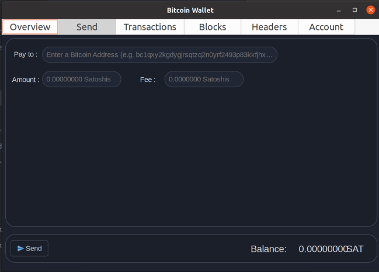

# 23C1-Rusteam-Fiuberico
<div align="center">
  <p align="center">
    <h1> BITCOIN NODE <h1 />
  </p>
  
</div>

## Sobre el proyecto
El objetivo principal del proyecto fue la creacion de un nodo de bitcoin siguiendo las [guias de desarrollo](https://developer.bitcoin.org/devguide/index.html) y las [guias de especificacion](https://developer.bitcoin.org/reference/index.html). El proyecto se realizo con el lenguaje de programacion [Rust](https://www.rust-lang.org/) y para la interfaz grafica se utilzo [Gtk](https://www.gtk.org/) y el modulo [Gtk-rs](https://gtk-rs.org/).

<div style="display: flex; justify-content: space-between;">
    
    
</div>


<div align="center">

## Funcionalidades del nodo 

</div>

<p align="center">
  
</p>

* **Descarga de Headers y Bloques**: El nodo es capaz de descargar y almacenar la cadena completa de `Headers` desde el inicio de la blockchain y los `bloques` completos a partir de la fecha de inicio del proyecto (10/04/23)
* **Conexion a otros Nodos peers**: El nodo es capaz de obtener mediante una DNS configurada ips de nodos activos y conectarse a estos realizando el `handshake` segun indica el protocolo de bitcoin.
* **Recibimiento de nuevos bloques**: El nodo es capaz de recibir nuevos bloques boradcasteados por otros nodos y guardarlos en la cadena de bloques y headers local
* **Validacion de bloques**: El nodo es capaz de validar cada nuevo bloque que llega mediante la `proof of work` del bloque recibido y la `proof of inclusion` de las transacciones del bloque, generando el `Merkle Tree` con las transacciones del bloque y comparando el Merkle Root generado con el especificado en el header del Bloque.
* **Seguimiento del UTXO set**: El nodo es capaz de mantener en todo momento la lista de `unspent transactions` de manera de poder utilizar la misma para realizar transacciones
* **Merkle proof of inclusion**: El nodo es capaz de, dada una transaccion y un bloque, devolver una merkle proof of inclusion, para que el usuario pueda verificar la existencia de la transaccion en el bloque.

<div align="center">

## Funcionalidades de la Wallet 

</div>
<p align="center">
  
</p>


* **Soporte para multiples cuentas**: El usuario puede ingresar una o mas cuentas que controla, especificando la clave publica y privada de cada una.
* **Balance de cuenta**: Para cada cuenta se puede visualizar el balance de la misma.
* **Notificacion sobre transaccion pendiente**: Cada vez que se recibe una transaccion pendiente por la red se notifica al usuario que una transaccion que lo involucra esta pendiente.
* **Notificacion sobre transaccion confirmadas**: Cada vez que se recibe un nuevo bloque confirmado, se notifica al usuario si alguna transaccion confiramda se encuentra en dicho bloque, y la muestra como confirmada en la interfaz.
* **Transacciones**: En todo momento, el usuario puede realizar transacciones desde una cuenta de la wallet ingresando la informacion necesaria. Soporta transacciones [P2PKH](https://academy.bit2me.com/que-es-p2pkh/). La transaccion generada se comunica al resto de los nodos para que la validen y pueda ser confirmada en un bloque.
* **Prueba de inclusion**: El ususario puede pedir una prueba de inclusion de una transaccion en un bloque y verificarla localmente.

### Archivo de configuracion
El archivo de configuracion `nodo.conf` contiene todas las configuraciones del programa y cambiando ese archivo se puede cambiar la cantidad de bloques/headers a descargar, cuantos persistir, la red a la cual conectarse (mainnet o testnet), conectarse a nodos especificos, cantidad de nodos a conectarse y varias opciones mas.
### Logs
Cuando el programa se corre automaticamente se crea una carpeta `logs` en donde se encuentran los detalles del flujo del programa y su estado. En `info.txt` se puede encontrar informacion general y util sobre el estado del nodo, en `error.txt` se pueden encontrar los distintos errores que hubo y en `messages.txt` se encuentran todos los mensajes que recibe nuestro nodo de otros peers.
### Interfaz grafica
El programa cuenta con una interfaz grafica muy user-friendly en la cual el usuario puede interactuar con la wallet de manera dinamica y facil. Al inciar el programa se muestra la descarga de la blockchain y su estado. Luego se muestran las siguientes ventanas:
* **Overview**: Muestra lo mas importante sobre la cuenta que esta seleccionada en ese momento: balance, address de la cuenta y transacciones recientes.
* **Send**: Muestra los campos a completar para poder hacer una transaccion desde la cuenta que esta seleccionada.
* **Transactions**: Muestra todas las transacciones realizadas por la cuenta seleccionada. Tambien permite hacer una prueba de inclusion proporcionando la informacion pedida.
* **Blocks**: Muestra los ultimos bloques descargados y cuenta con una barra de busqueda para poder visualizar la informacion de cualquiera de los bloques que hayan sido descargados localmente
* **Headers**: Muestra los ultimos y los primeros headers descargados y cuenta con una barra de busqueda para poder visualizar la informacion de cualquiera de los bloques que hayan sido descargados localmente.
* **Account**: Muestra la cuenta que esta seleccionada y permite ingresar una nueva cuenta a la wallet.
## Requisitos
* Tener instalado `Rust` (se puede descargar de la pagina oficial https://www.rust-lang.org/tools/install)
* Tener insalado `Gtk3` (https://www.gtk.org/docs/installations/linux)
## Modo de uso
Para ejecutar el programa con UI es necesario navegar al directorio donde se encuentra el proyecto y correr en la terminal
```sh
   cargo run nodo.conf -i
```

En caso de querer ejecutar la aplicacion sin UI y querer interactuar con la wallet mediante una pseudo-interfaz por la terminal, se debera correr

```sh
   cargo run nodo.conf
```
## Bibliografia util y diagramas

* **Diagramas**: https://lucid.app/documents/view/24778bc5-a35d-4e87-a5ad-c2552bd2a0ec
* **Presentacion Entrega Intermedia**: https://www.canva.com/design/DAFjmdv7rnM/IeBxNe9kYaOrCZaoz6f55w/edit?utm_content=DAFjmdv7rnM&utm_campaign=designshare&utm_medium=link2&utm_source=sharebutton
* **Presentacion Entrega Fin Cursada**: https://www.canva.com/design/DAFm19ESnFU/V6mXLL9rlMYIW4rqmKbV5A/edit?utm_content=DAFm19ESnFU&utm_campaign=designshare&utm_medium=link2&utm_source=sharebutton
* **Presentacion Entrega Final**: https://www.canva.com/design/DAFqmYD30IA/Q1KVnpzEvug8lWd8ri6kjQ/edit?utm_content=DAFqmYD30IA&utm_campaign=designshare&utm_medium=link2&utm_source=sharebutton
### Informe con explicacion detallada del proyecto

https://docs.google.com/document/d/1p5l8UjiY5e11kFwzyFX7NvbX8w49kqBh/edit

## Miembros del grupo
- Facundo De La Plata
- Alan Cantero
- Martin Bucca

