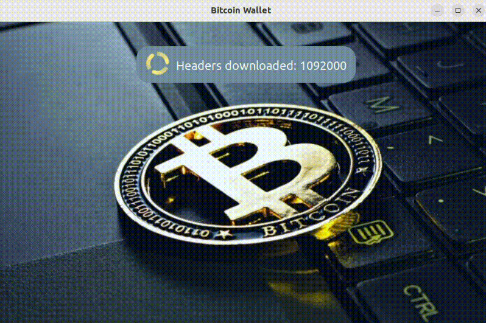
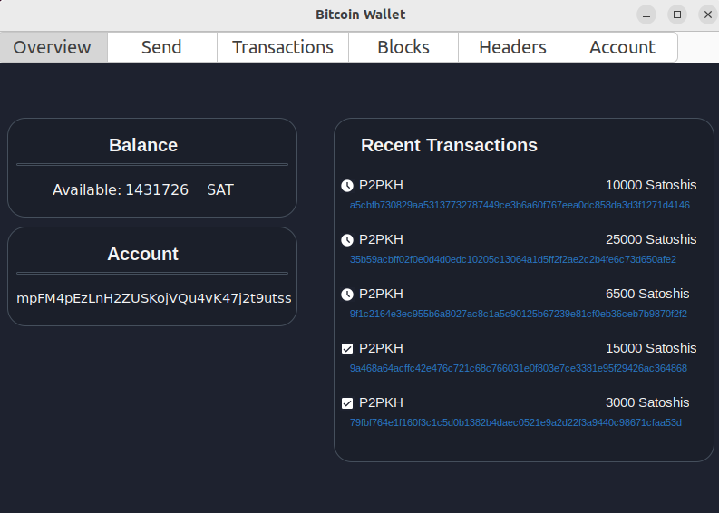
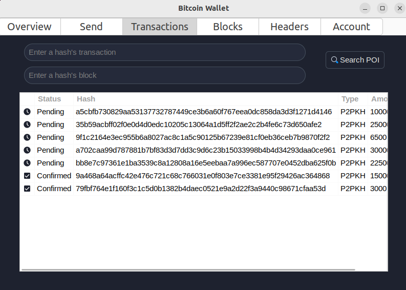
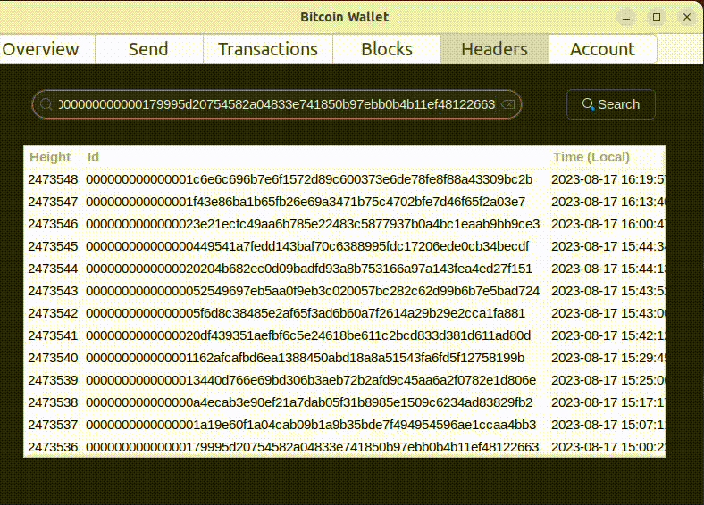
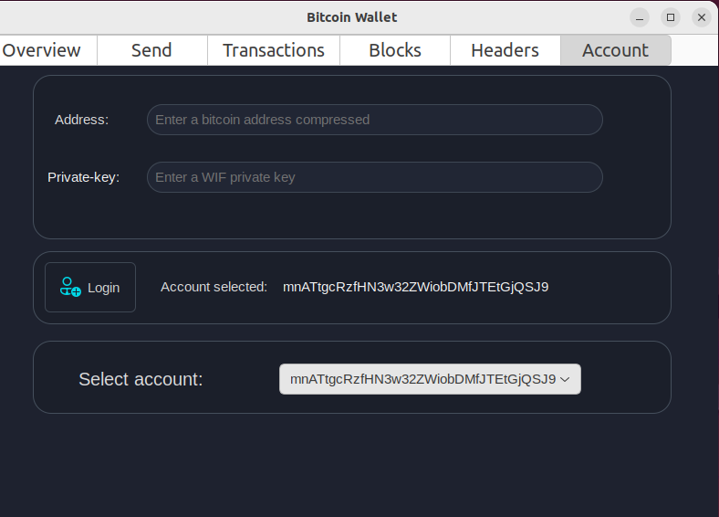

<div align="center">
  <p align="center">
    <h1> BITCOIN NODE <h1 />
  </p>
  
</div>

## Table of Contents
- [About the project](#about-the-project)
- [Node Functionalities](#node-functionalities)
- [Wallet functionalities](#wallet-functionalities)
- [Specifications](#specifications)
	- [Configuration file](#configuration-file)
  	- [Logs](#logs)
	- [Graphical User Interface](#graphical-user-interface)
- [Prerequisites](#prerequisites)
- [Installation and running the node](#installation-and-running-the-node)
- [Documentation](#documentation)
- [Useful References and Diagrams](#useful-references-and-diagrams)
- [Contributors](#contributors)
  
## About the project
The main objective of the project was the creation of a Bitcoin node following the development guides and the specification guides. The project was implemented using the programming language Rust, and for the graphical interface, Gtk and the Gtk-rs module were used.

<div align="center">
  
  
</div>

<div align="center">
  
  
</div>

<div align="center">
  
  
</div>


<div align="center">
  
## Node Functionalities
</div>

<p align="center">
  
</p>

✔️ **Download of Headers and Blocks**: The node is capable of downloading and storing the complete chain of Headers from the beginning of the blockchain and the complete blocks starting from the project's inception date (10/04/23).

✔️ **Connection to Other Peer Nodes**: The node is capable of obtaining IP addresses of active nodes through a configured DNS and connecting to them by performing the handshake as indicated by the Bitcoin protocol. Throughout the whole project **Tcp connections** were used.

✔️ **Reception of New Blocks**: The node is capable of receiving new blocks broadcasted by other nodes and saving them in the local blockchain and headers.

✔️ **Block Validation**: The node is capable of validating each new block that arrives through the proof of work of the received block and the proof of inclusion of the block's transactions, generating the Merkle Tree with the block's transactions and comparing the generated Merkle Root with the one specified in the block's header.

✔️ **UTXO Set Tracking**: The node is capable of maintaining the list of unspent transactions at all times, allowing it to use the same for performing transactions.

✔️ **Merkle Proof of Inclusion**: The node is capable of providing a Merkle proof of inclusion given a transaction and a block, allowing the user to verify the existence of the transaction in the block.

<div align="center">

## Wallet Functionalities
</div>
<p align="center">
  
</p>

✔️ **Support for Multiple Accounts**: The user can input one or more accounts they control, specifying the public and private key for each.

✔️ **Account Balance**: The balance for each account can be viewed.

✔️ **Pending Transaction Notification**: Whenever a pending transaction is received from the network, the user is notified that a transaction involving them is pending.

✔️ **Confirmed Transaction Notification**: Whenever a new confirmed block is received, the user is notified if any confirmed transactions are included in the block, and they are shown as confirmed in the interface.

✔️ **Transactions**: At any time, the user can perform transactions from a wallet account by entering the necessary information. It supports [P2PKH](https://learnmeabitcoin.com/technical/p2pkh) transactions. The generated transaction is broadcasted to the rest of the nodes for validation and can be confirmed in a block.

✔️ **Proof of Inclusion**: The user can request a proof of inclusion for a transaction in a block and verify it locally.

## Specifications
### Configuration File
The configuration file node.conf contains all program configurations, and by modifying this file, you can change the number of blocks/headers to download, how many to persist, the network to connect to (mainnet or testnet), specific nodes to connect to, the number of nodes to connect to, and various other options.
### Logs
When the program runs, it automatically creates a `logs` folder where program flow details and status are stored. In `info.txt`, you can find general and useful information about the node's status. `error.txt` contains different encountered errors, and `messages.txt` stores all the messages our node receives from other peers.
### Graphical User Interface
The program features a very user-friendly graphical interface in which the user can interact with the wallet dynamically and easily. Upon starting the program, the blockchain download and its status are displayed. Subsequently, the following windows are shown:
* **Overview**: Displays the most important information about the currently selected account: balance, account address, and recent transactions.
* **Send**: Presents the fields to be completed in order to initiate a transaction from the currently selected account.
* **Transactions**: Shows all transactions carried out by the selected account. It also allows for a proof of inclusion test by providing the requested information.
* **Blocks**: Displays the latest downloaded blocks and features a search bar to visualize information about any of the locally downloaded blocks.
* **Headers**: Shows both the latest and initial headers downloaded, equipped with a search bar to view information about any of the locally downloaded blocks.
* **Account**: Displays the currently selected account and allows the addition of a new account to the wallet.

## Prerequisites
* Have `Rust` installed (can be downloaded from the official website: https://www.rust-lang.org/tools/install)
* Have `Gtk3` installed (https://www.gtk.org/docs/installations/linux)
  
## Installation and Running the Node 💻
1. Clone or download this repository to your local machine.
2. Open a terminal and navigate to the directory where the project is located using the `cd` command.
3. Make sure to have `Rust` and the package manager `Cargo` installed (it comes automatically when you install Rust), and ensure that you have `Gtk3` installed.
   
To run the program **with a UI**, navigate to the directory where the project is located and execute the following command in the terminal:
```
   cargo run nodo.conf -i
```

If you wish to run the application **without a UI** and interact with the wallet through a pseudo-interface in the terminal, you should run:
```
   cargo run nodo.conf
```

## Documentation 📖

To view the detailed documentation for this project, un the following command in your terminal from the project's root directory:
```
   cargo doc --open
```

## Useful References and Diagrams

📚 **Bibliography**:
* [Bitcoin Developer Documentation](https://developer.bitcoin.org/devguide/index.html)
* [Bitcoin Protocol Specification](https://developer.bitcoin.org/reference/index.html)
* [Rust Programming Language](https://www.rust-lang.org/)
* [Gtk - The GIMP Toolkit](https://www.gtk.org/)
* [Gtk-rs - Rust bindings for Gtk](https://gtk-rs.org/)
* [P2PKH Transactions Explained](https://academy.bit2me.com/que-es-p2pkh/)
  
ℹ️ **Diagrams, presentations and reports (Spanish 🇦🇷)**
* [Diagrams](https://lucid.app/documents/view/24778bc5-a35d-4e87-a5ad-c2552bd2a0ec)
* [First Presentation (intermediate)](https://www.canva.com/design/DAFjmdv7rnM/IeBxNe9kYaOrCZaoz6f55w/edit?utm_content=DAFjmdv7rnM&utm_campaign=designshare&utm_medium=link2&utm_source=sharebutton) 
* [Second Presentation (end of class period)](https://www.canva.com/design/DAFm19ESnFU/V6mXLL9rlMYIW4rqmKbV5A/edit?utm_content=DAFm19ESnFU&utm_campaign=designshare&utm_medium=link2&utm_source=sharebutton)
* [Final presentation](https://www.canva.com/design/DAFqmYD30IA/Q1KVnpzEvug8lWd8ri6kjQ/edit?utm_content=DAFqmYD30IA&utm_campaign=designshare&utm_medium=link2&utm_source=sharebutton)
* [Report with detailed explanation of the project](https://docs.google.com/document/d/1p5l8UjiY5e11kFwzyFX7NvbX8w49kqBh/edit)

## Contributors

This project was proposed and guided by [Taller de Programacion I (Deymonnaz)](https://taller-1-fiuba-rust.github.io/), [Facultad de Ingenieria](http://www.fi.uba.ar/), [Universidad de Buenos Aires](https://www.uba.ar/).
This project was jointly elaborated with:
- [Facundo De La Plata](https://github.com/FaCu97)
- [Alan Cantero](https://github.com/CanteroAlann)
  

